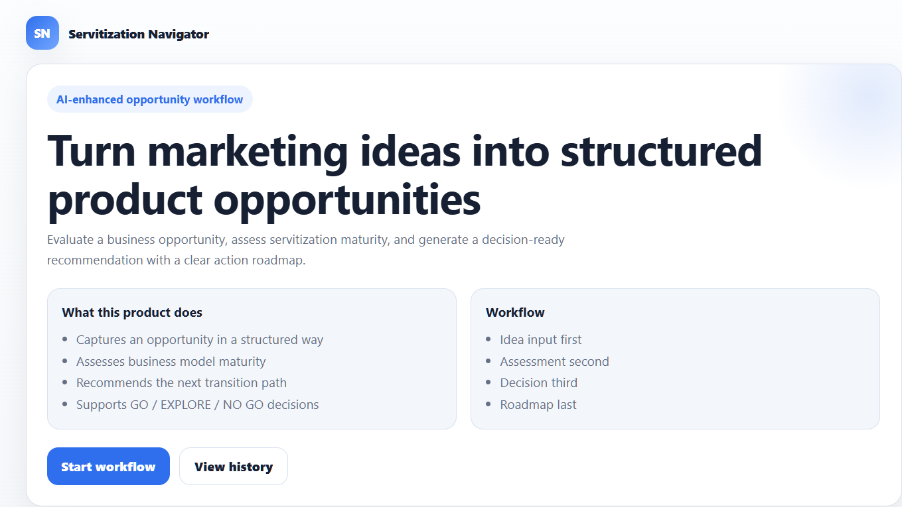
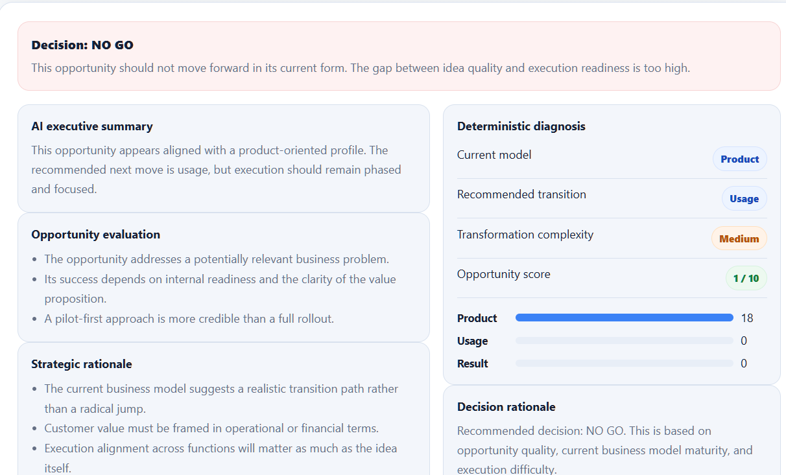
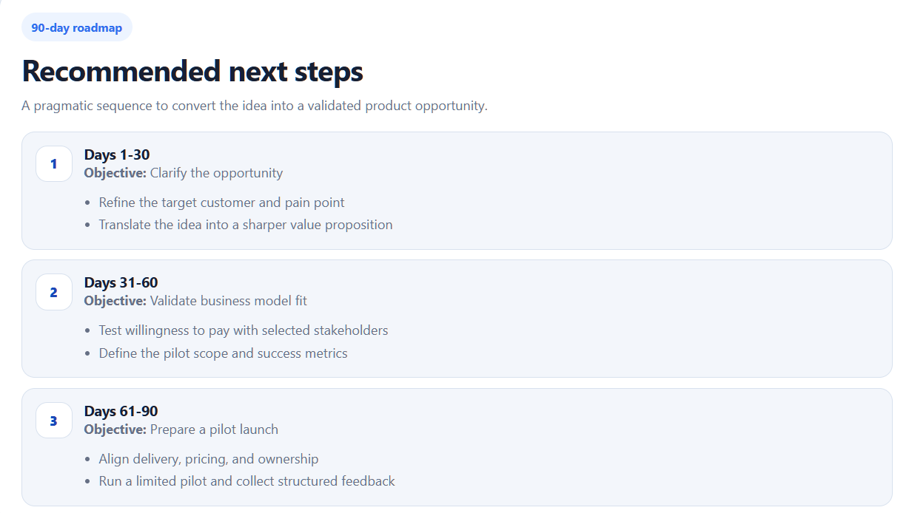
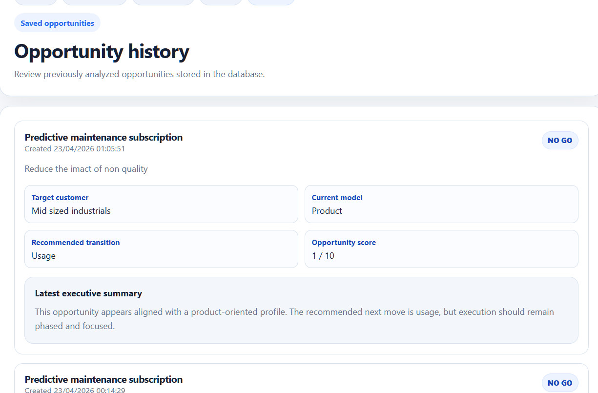

# Servitization Navigator

AI-powered decision support tool to transform marketing ideas into structured product opportunities.

---

## Overview

Servitization Navigator is a full-stack application designed to help teams move from vague marketing ideas to clear, structured, and actionable product opportunities.

It combines:
- structured input
- deterministic business model scoring
- AI-generated strategic analysis

The goal is to support decision-making around:
- whether an opportunity should move forward
- how complex the transformation will be
- what the next steps should be

---

## Problem

In many organizations, marketing ideas are:

- poorly structured
- evaluated inconsistently
- disconnected from execution capabilities
- not translated into clear product opportunities

As a result:
- weak ideas move forward
- strong ideas are underdeveloped
- decision-making lacks rigor

---

## Solution

This tool introduces a structured workflow:

1. Capture the opportunity clearly
2. Assess business model maturity
3. Generate a deterministic diagnosis
4. Enrich the analysis with AI
5. Produce a decision-ready output

---

## How it works

The application is built around a 4-step workflow.

First, the user describes the opportunity in a structured format, including value proposition, target customer, and problem.

Then, a questionnaire evaluates the company's maturity across business model dimensions such as revenue model, capabilities, and market context.

Based on the answers, a deterministic scoring engine identifies:
- current business model
- recommended transition
- transformation complexity
- opportunity score
- GO / EXPLORE / NO GO decision

Finally, an AI layer generates:
- executive summary
- strategic rationale
- priority actions
- key risks
- a 90-day roadmap

---

## Features

- Structured opportunity input
- Business model assessment (9 questions)
- Deterministic scoring engine
- AI-generated strategic analysis
- Decision output (GO / EXPLORE / NO GO)
- 90-day roadmap generation
- Opportunity history stored in database

---

## Architecture

### Frontend
- React
- TypeScript
- Vite

### Backend
- Node.js
- Express
- TypeScript

### Data
- Prisma ORM
- SQLite (local development)

### AI Integration
- OpenAI API

---

## Project structure
backend/
src/
prisma/

frontend/
src/

---

## Run locally

### 1. Clone the repository

```bash
git clone https://github.com/Manaf-PM/servitization-navigator.git
cd servitization-navigator

### 2. Setup backend
cd backend
npm install
cp .env.example .env

Update .env:
OPENAI_API_KEY=your_api_key
OPENAI_MODEL=your_model
DATABASE_URL="file:./dev.db"
PORT=4000

Then:
npm run prisma:generate
npm run prisma:migrate
npm run dev

3. Setup frontend
cd ../frontend
npm install
npm run dev

Open:
http://localhost:5173

Preview





Key takeaways

This project demonstrates:

- ability to design a structured product workflow
- translation of business logic into deterministic scoring
- integration of AI into decision support
- full-stack implementation (frontend + backend + database)
- focus on product thinking, not just code

Future improvements
- industry-specific recommendations
- user accounts and saved sessions
- exportable reports
- team collaboration workflow
- opportunity portfolio dashboard

Author

Built by Manaf EL MEZRAOUI